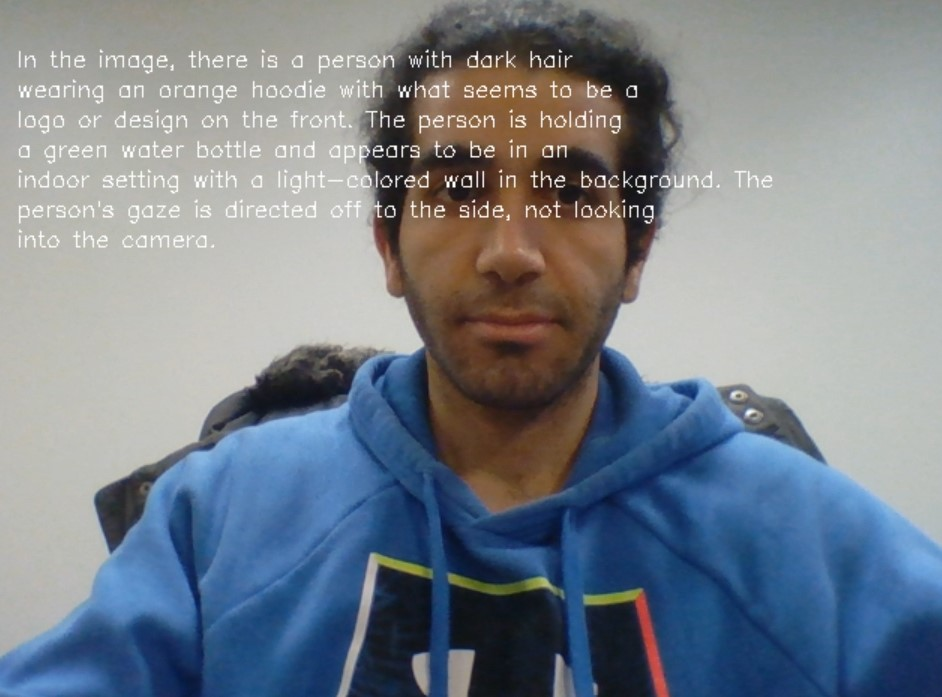

# VideoQA
This application opens the webcam and by clicking capture, it describe what it can see (objects, details, etc.) as well as answering questions based on the video

  

<h3>Result images:</h3>
  
  
  
  
