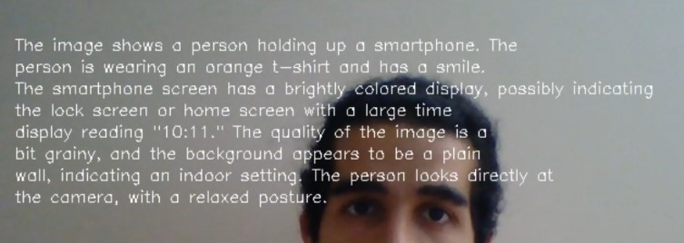

<h1>Video Question Answering</h1> 
<h2>This application opens the webcam and by clicking capture, it describes what it can see (objects, details, etc.) as well as answers questions based on the video.</h2>

  

<h3>Result images:</h3>

  
  
